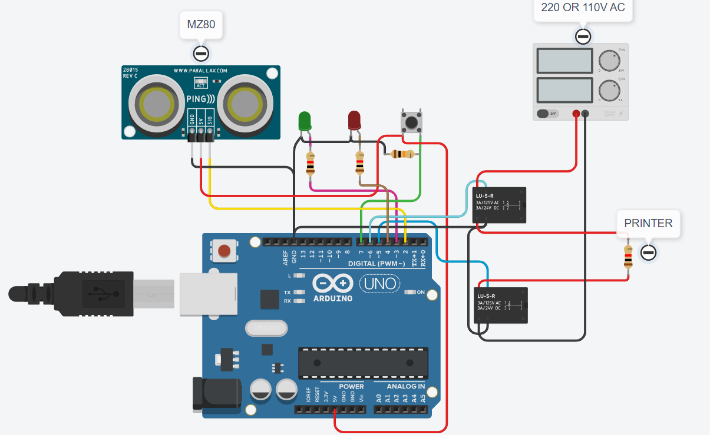

# auto-circuit-breaker-for-3d-printers
This is the automatic printer shutter! With the mz80 sensor on it, it sends a signal to the arduino that it is off or on, and the arduino can automatically turn off the printer by turning on and off the relays connected to the cables from which the printer is powered.

### Circuit

### Video
https://youtu.be/4XN0bHsPKvw
